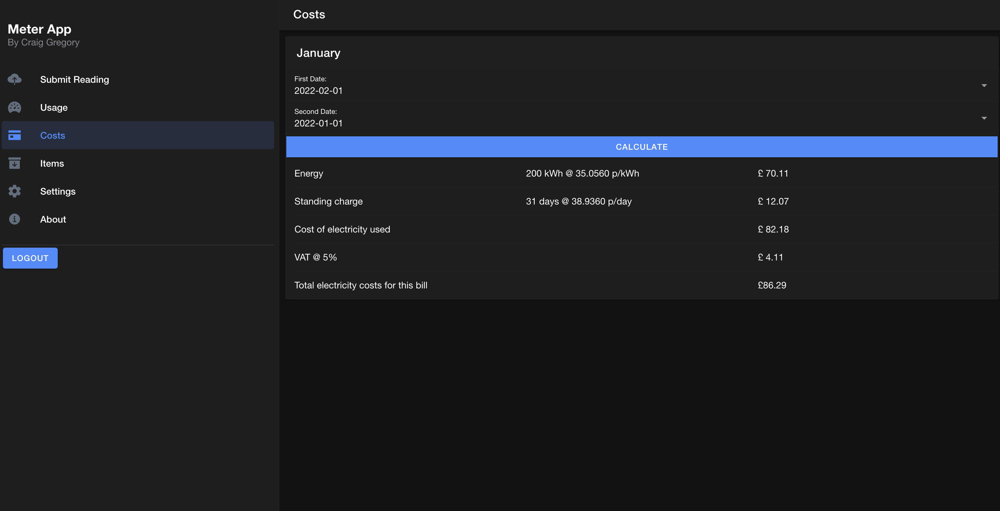
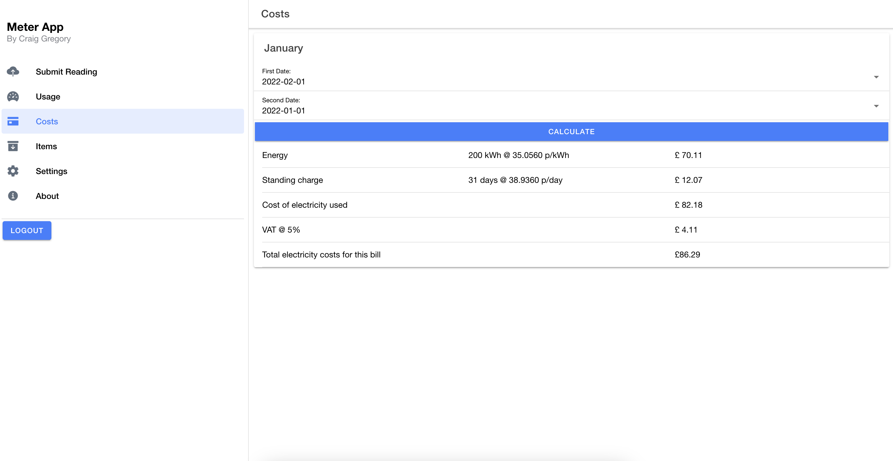

<h1 align="center">
Ionic Meter App
</h1>
Keep track of your electric usage and costs with this easy to use electric meter app built using Ionic & Firebase.

#

## Table of contents

* [General info](#general-info)
* [Technologies](#technologies)
* [Features](#features)
* [Screenshots](#screenshots)
* [Live Demo](#live-demo)

## General info

I was inspired to create this project as my energy provider doesn't provide an easy way to keep track of energy usage and costs throughout the month. This app can be accessed anywhere, as the data is stored in firestore and is setup with firebase authentication so you can keep your usage secure and hidden behind a login.

This project was originally created in October 2022, but a new repository has been created since then to showcase a demo version of the app.

## Technologies

Project is created with:

* Angular
* Ionic
* Firestore
* Firebase Authentication

## Features

* Add & Remove meter readings, date, current kWh & whether the rate was added by the Customer or is an Estimation (more for my personal usage)
* View all meter readings in a table format.
* Check costs between each reading, the `first date` is always going to be the most recent date you want to compare it to whilst the `second date` would be the more historic date.
	* You will need to edit the costs manually in `src/app/pages/views/costs/costs.component.ts` line 12 & 13. `EnergyRate` = energy cost per kWh, `standingChargeRate` is your energy suppliers daily standing charge.
* Add items to check their usage by supplying the items watt rating and how many hours you intend to use it. This will give you the energy cost of the item and how much energy in kWh it uses. These items are also saved in firestore and can be easily deleted.

## Screenshots

* Ionic Dark Mode

* Ionic Light Mode

## Live Demo

This is a demo version of the app which is connected to a different database from the one I use. Authentication is enabled but you can test with the following login details:

* Username: `demo@test.com`

* Password: `Test12345`

[Ionic Meter App](https://fir-meter-app.web.app/)